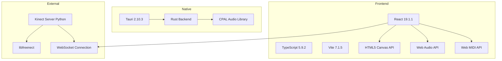

# Repository Analysis: Realtime DJ Visualizer

**Analysis Date:** 2026-04-26  
**Repository:** Visual Project (Realtime DJ Visualizer)  
**Location:** `/Users/spc/Desktop/visual project`

---

## Executive Summary

This is a **high-performance, web-based audio visualizer** designed for live DJ performances and stage productions. The application combines real-time audio analysis with multiple visualization modes, MIDI controller integration, and advanced input sources (Kinect depth sensor, webcam). Built with React, TypeScript, and Tauri for native desktop deployment.

### Key Highlights
- **Production-ready audio engine** with adaptive normalization and beat detection
- **Multi-layered visual system** with 6+ visualization modes
- **5 input types:** Microphone, System Audio, MIDI Controllers, Webcam, Kinect
- **Native desktop app** via Tauri with Rust backend
- **Stage-optimized UX** with fullscreen mode, HUD, and performance macros

---

## Architecture Overview

### Technology Stack



### Core Components

| Component | Purpose | Technology |
|-----------|---------|------------|
| **Frontend UI** | React-based control interface | React 19, TypeScript |
| **Audio Engine** | Real-time audio analysis & processing | Web Audio API, Custom DSP |
| **Visualizer** | Canvas-based rendering system | HTML5 Canvas, Custom algorithms |
| **MIDI Handler** | DJ controller integration | Web MIDI API |
| **Kinect Server** | Depth sensor data streaming | Python, libfreenect, WebSocket |
| **Native Shell** | Desktop app wrapper | Tauri, Rust |
| **Audio Capture** | System audio routing | Rust CPAL library |

---

## Project Structure

```
visual-project/
├── src/                          # Frontend source code
│   ├── App.tsx                   # Main application component (2545 lines)
│   ├── main.tsx                  # React entry point
│   ├── types.ts                  # TypeScript type definitions
│   ├── audioProcessor.ts         # Audio analysis engine (349 lines)
│   ├── djState.ts                # MIDI/DJ controller state management
│   ├── styles.css                # Application styles
│   │
│   ├── components/               # React components
│   │   └── AudioMonitor.tsx      # Audio level monitoring
│   │
│   ├── hooks/                    # Custom React hooks
│   │   ├── useMicrophoneAnalyzer.ts    # Microphone input
│   │   ├── useSystemAudioAnalyzer.ts   # System audio capture
│   │   ├── useTauriMicrophone.ts       # Tauri native audio
│   │   ├── useDjMidi.ts                # MIDI controller handling
│   │   ├── useWebcam.ts                # Webcam capture
│   │   └── useKinect.ts                # Kinect depth data
│   │
│   ├── visualizer/               # Visualization renderers
│   │   ├── drawVisualizer.ts     # Main 2D audio visualizer (1055 lines)
│   │   ├── drawKinect3D.ts       # 3D depth visualization
│   │   ├── drawAsciiWebcam.ts    # ASCII art webcam
│   │   ├── drawTiles.ts          # Procedural tiles
│   │   ├── drawFractal.ts        # Fractal recursion
│   │   ├── drawGeometry.ts       # Geometric patterns
│   │   └── drawMedia.ts          # Media layer rendering
│   │
│   └── utils/
│       └── simplex.ts            # Simplex noise generator
│
├── src-tauri/                    # Tauri native backend
│   ├── src/
│   │   ├── main.rs               # Tauri entry point
│   │   ├── lib.rs                # Library exports
│   │   ├── kinect_server.rs      # Kinect server management
│   │   └── audio_capture.rs      # Native audio capture
│   ├── Cargo.toml                # Rust dependencies
│   └── tauri.conf.json           # Tauri configuration
│
├── scripts/                      # Build and utility scripts
│   ├── build/                    # Build-time transformations
│   ├── fixes/                    # Code fix utilities
│   └── servers/                  # External servers
│       ├── kinect_server.py      # Python Kinect server
│       └── kinect_server.cjs     # Node.js Kinect server
│
├── docs/                         # Documentation
│   ├── SETUP.md                  # Installation guide
│   ├── INPUTS.md                 # Input configuration
│   ├── TESTING.md                # Testing procedures
│   └── TROUBLESHOOTING.md        # Common issues
│
├── electron/                     # Electron wrapper (alternative)
│   ├── main.cjs
│   └── preload.cjs
│
├── package.json                  # Node dependencies
├── vite.config.ts                # Vite configuration
└── README.md                     # Project overview
```

---

## Feature Analysis

### 1. Audio Processing System

**Location:** [`src/audioProcessor.ts`](../src/audioProcessor.ts)

#### Capabilities
- **Adaptive Per-Band Normalization:** Dynamic AGC for consistent visual response
- **Multi-Signal Beat Detection:** Bass + energy + waveform transient analysis
- **BPM Estimation:** Real-time tempo detection with confidence scoring
- **Frequency Analysis:** Configurable FFT with bass/mid/high/treble separation
- **Spring-Based Smoothing:** Physics-driven animation for organic motion
- **Spectral Features:** Centroid (brightness) and texture (roughness) analysis

#### Key Classes
```typescript
class AudioProcessor {
  - process(frequency, waveform): AudioMetrics
  - setConfig(config): void
  // Uses spring physics instead of linear interpolation
  // Implements dynamic normalizers per frequency band
}

class AudioSpring {
  // Organic acceleration/deceleration
  - update(target): number
}

class DynamicNormalizer {
  // Adaptive floor/peak tracking
  - update(raw, decayRate): number
}
```

#### Configuration Parameters
- `dspFftSize`: FFT resolution (default: 2048)
- `dspMinDecibels`: Minimum dB threshold (-80)
- `dspMaxDecibels`: Maximum dB threshold (-10)
- `dspBassEnd`: Bass frequency cutoff (5%)
- `dspMidsEnd`: Mids frequency cutoff (40%)
- `dspHighsEnd`: Highs frequency cutoff (75%)
- `springTension`: Physics spring tension (0.3)
- `springFriction`: Physics spring damping (0.65)
- `agcDecayRate`: AGC peak decay rate (0.99)

---

### 2. Visualization Modes

**Location:** [`src/visualizer/`](../src/visualizer/)

#### Available Modes

| Mode | File | Description |
|------|------|-------------|
| **Audio 2D** | `drawVisualizer.ts` | Character-based audio spectrum with 8 movement styles |
| **Webcam ASCII** | `drawAsciiWebcam.ts` | Real-time ASCII art from webcam feed |
| **Kinect 3D** | `drawKinect3D.ts` | 3D depth visualization with cyberpunk effects |
| **Procedural Tiles** | `drawTiles.ts` | Geometric tile patterns |
| **Fractal Recursion** | `drawFractal.ts` | Recursive fractal generation |
| **Geometry Lines** | `drawGeometry.ts` | Dynamic geometric patterns |
| **Media Layer** | `drawMedia.ts` | Video/image overlay with audio reactivity |

#### Movement Styles (Audio 2D)
1. **Ripple:** Radial wave propagation from center
2. **Wave:** Vertical sine wave motion
3. **Matrix:** Matrix rain effect
4. **Static:** Fixed equalizer bars
5. **Glitch:** Random displacement effects
6. **Orbit:** Circular rotation patterns
7. **Tunnel:** Depth-based perspective
8. **Pulse:** Beat-synchronized expansion

#### Visual Settings (100+ Parameters)
- Grid dimensions, spacing, character density
- Color modes: white, neon, rainbow, thermal, custom
- Background color and opacity
- Bass/mid/high thresholds
- Animation engine: beat threshold, lift/sway strength, terrain lift
- Kinect: depth range, scale, glow, distortion, mirror, crop, sway
- ASCII: resolution, character set, glitch intensity
- Procedural: tile size, complexity, rotation speed
- Fractal: depth, zoom, line width, recursion

---

### 3. Input Systems

#### 3.1 Microphone Input
**Hook:** [`src/hooks/useMicrophoneAnalyzer.ts`](../src/hooks/useMicrophoneAnalyzer.ts)

- Uses Web Audio API `getUserMedia()`
- Configurable FFT size and smoothing
- Auto-excludes Kinect microphone from device list
- Real-time frequency and waveform analysis
- Metrics update interval: 180ms (configurable)

#### 3.2 System Audio Capture
**Hook:** [`src/hooks/useSystemAudioAnalyzer.ts`](../src/hooks/useSystemAudioAnalyzer.ts)

- Requires virtual audio device (BlackHole/Stereo Mix/PulseAudio)
- Same analysis pipeline as microphone
- Platform-specific setup documented in [`docs/INPUTS.md`](../docs/INPUTS.md)

#### 3.3 MIDI Controllers
**Hook:** [`src/hooks/useDjMidi.ts`](../src/hooks/useDjMidi.ts)  
**State:** [`src/djState.ts`](../src/djState.ts)

**Supported Controls:**
- Mixer: Trim, EQ (Hi/Mid/Low), Color FX, Channel Faders, Crossfader
- Deck: Jog Wheel, Play/Pause, Tempo Fader, Pitch Bend, Sync
- Pads: 8 performance pads per deck
- FX: Effect selection, depth, beat buttons
- Mic: Level, EQ, Talkover

**Default CC Mappings:**
```typescript
CC 10/11: Mixer A/B Trim
CC 14-16: Mixer A EQ (Hi/Mid/Low)
CC 18-20: Mixer B EQ (Hi/Mid/Low)
CC 8/9: Channel Faders A/B
CC 1: Crossfader
CC 25: FX Depth
Note 41/42: Play/Pause A/B
Note 60-67: Deck A Pads
```

#### 3.4 Webcam
**Hook:** [`src/hooks/useWebcam.ts`](../src/hooks/useWebcam.ts)

- Captures video stream via `getUserMedia()`
- Converts to ASCII art in real-time
- Configurable resolution and character sets
- Audio-reactive glitch effects

#### 3.5 Kinect Depth Sensor
**Hook:** [`src/hooks/useKinect.ts`](../src/hooks/useKinect.ts)  
**Server:** [`scripts/servers/kinect_server.py`](../scripts/servers/kinect_server.py)

**Architecture:**
```
Kinect USB → libfreenect → Python Server → WebSocket (ws://localhost:8765) → React Hook → Canvas Renderer
```

**Features:**
- Auto-start server on Tauri app launch
- Configurable downsampling (1x, 2x, 4x)
- Real-time depth streaming (30 FPS)
- Auto-detection of frame size
- 3D mesh generation with audio reactivity
- Cyberpunk effects: light trails, z-axis coloring, shockwave, wireframe, surveillance mode

**Server Configuration:**
- Downsampling factor: 2 (320x240 default)
- Normalization: 11-bit → 8-bit
- Tilt control: -30° to +30°
- LED control: off/green/red/yellow/blink

---

### 4. Layer System

**Location:** [`src/App.tsx`](../src/App.tsx) (lines 17-26)

```typescript
type Layer = {
  id: string;
  type: 'audio2d' | 'webcamAscii' | 'kinect3d' | 'media';
  mediaUrl?: string;
  mediaType?: 'video' | 'image' | null;
  enabled: boolean;
  settings: VisualSettings;
  opacity: number;
  blendMode: GlobalCompositeOperation;
};
```

**Capabilities:**
- Multiple simultaneous layers
- Independent settings per layer
- Opacity and blend mode control
- Media layer support (video/image)
- Preset system with A/B comparison
- Layer-specific MIDI mapping

---

### 5. Performance Optimizations

#### Rendering Pipeline
1. **Decoupled State:** React state separated from animation loop
2. **Pre-calculated Geometry:** Grid positions computed once
3. **Minimal DOM Reflows:** Canvas-only rendering
4. **RequestAnimationFrame:** 60 FPS target
5. **Metrics Throttling:** UI updates at 180ms intervals
6. **Spring Physics:** Smooth motion without excessive calculations

#### Audio Processing
- Configurable FFT size (trade-off: detail vs. CPU)
- Adaptive smoothing (lower latency vs. stability)
- Per-band normalization (consistent response across material)
- Transient detection (fast attack for beats)

---

## Development Workflow

### Running the Application

#### Web Development (Fastest)
```bash
npm run dev
# Access at http://localhost:5173
```

#### Native App Development (Recommended)
```bash
npm run tauri:dev
# Launches Tauri window with auto-start Kinect server
```

#### Production Build
```bash
npm run tauri:build
# Creates platform-specific installers in src-tauri/target/release/bundle/
```

### Build Scripts

The [`scripts/`](../scripts/) directory contains numerous build-time transformations:

**Build Scripts:**
- `add_layer_move.cjs`: Layer movement functionality
- `add-globals.cjs`: Global variable injection
- `add-media-params.cjs`: Media parameter additions
- `extend-settings.cjs`: Settings extension
- `rewrite_app.cjs`: App structure rewriting

**Fix Scripts:**
- `fix_media_ts.cjs`: Media TypeScript fixes
- `fix_ui_robust.cjs`: UI robustness improvements
- `optimize_kinect.cjs`: Kinect optimization

These appear to be code generation/transformation tools used during development.

---

## Configuration Files

### Package.json
- **Type:** ES Module
- **Main:** `electron/main.cjs` (Electron support)
- **Scripts:** dev, build, preview, electron:dev, tauri:dev, tauri:build
- **Dependencies:** React 19, Tauri API, NAN (native addons)
- **DevDependencies:** TypeScript, Vite, Electron, Tauri CLI

### Tauri Configuration
**File:** [`src-tauri/tauri.conf.json`](../src-tauri/tauri.conf.json)

- App ID: `com.visualproject.app`
- Product Name: Visual Console
- Build targets: macOS (dmg/zip), Windows (msi/portable), Linux (deb/AppImage)

### Rust Dependencies
**File:** [`src-tauri/Cargo.toml`](../src-tauri/Cargo.toml)

- `tauri`: 2.10.3
- `cpal`: 0.15 (audio capture)
- `tokio`: 1.x (async runtime)
- `ringbuf`: 0.3 (audio buffering)
- `serde`: 1.0 (serialization)

---

## Key Insights

### Strengths
1. **Production-Ready Audio Engine:** Advanced DSP with adaptive normalization and beat detection
2. **Modular Architecture:** Clean separation of concerns (hooks, visualizers, processors)
3. **Extensive Customization:** 100+ parameters for fine-tuning visuals
4. **Multi-Platform:** Web, Electron, and Tauri support
5. **Stage-Optimized UX:** Fullscreen mode, HUD, performance macros, favorites
6. **Comprehensive Documentation:** Setup, inputs, testing, troubleshooting guides

### Technical Highlights
1. **Spring Physics:** Organic motion instead of linear interpolation
2. **Dynamic Normalization:** Adaptive AGC per frequency band
3. **Multi-Signal Beat Detection:** Bass + energy + transient analysis
4. **Layer System:** Composable visual layers with blend modes
5. **Kinect Integration:** Full 3D depth visualization with cyberpunk effects
6. **MIDI Mapping:** Flexible DJ controller integration

### Potential Areas for Enhancement
1. **Code Organization:** Main `App.tsx` is 2545 lines (could be split into smaller components)
2. **Build Scripts:** Many transformation scripts suggest complex build process
3. **Type Safety:** Some `any` types in MIDI handling and config
4. **Testing:** No visible test files (though `docs/TESTING.md` exists)
5. **Documentation:** Code comments could be more extensive
6. **State Management:** Could benefit from Context API or state management library

---

## Use Cases

### Primary Use Cases
1. **Live DJ Performances:** Real-time audio visualization for club/festival stages
2. **Music Production:** Visual feedback during mixing/mastering
3. **VJ Sets:** Layered visuals with MIDI controller manipulation
4. **Interactive Installations:** Kinect-based interactive art
5. **Streaming:** Visual backdrop for live streams/broadcasts

### Input Scenarios
- **Microphone:** Live vocals, instruments, ambient sound
- **System Audio:** DJ software output, music playback
- **MIDI Controller:** Pioneer DDJ, Numark, Traktor controllers
- **Webcam:** Performer/audience visualization
- **Kinect:** Depth-based interactive visuals

---

## Dependencies Analysis

### Frontend Dependencies
- **React 19.1.1:** Latest React with concurrent features
- **TypeScript 5.9.2:** Type safety and modern JS features
- **Vite 7.1.5:** Fast build tool and dev server
- **Tauri API 2.10.1:** Native desktop integration

### Backend Dependencies (Rust)
- **Tauri 2.10.3:** Desktop app framework
- **CPAL 0.15:** Cross-platform audio library
- **Tokio 1.x:** Async runtime for Rust
- **Ringbuf 0.3:** Lock-free ring buffer for audio

### External Dependencies
- **libfreenect:** Kinect driver (system-level)
- **Python 3:** Kinect server runtime
- **Virtual Audio Device:** System audio routing (BlackHole/Stereo Mix)

---

## File Size Analysis

### Large Files (Complexity Indicators)
1. **App.tsx:** 2545 lines - Main application logic
2. **drawVisualizer.ts:** 1055 lines - Core visualization engine
3. **audioProcessor.ts:** 349 lines - Audio analysis engine
4. **useMicrophoneAnalyzer.ts:** 233 lines - Audio input handling

These files represent the core complexity of the application and would be primary targets for refactoring or enhancement.

---

## Conclusion

This is a **mature, feature-rich audio visualization platform** with production-grade audio processing, extensive customization options, and multiple input modalities. The codebase demonstrates strong technical capabilities in real-time audio analysis, canvas rendering, and native desktop integration.

The architecture is well-structured with clear separation between audio processing, visualization, and input handling. The use of modern technologies (React 19, TypeScript, Tauri) and advanced techniques (spring physics, dynamic normalization, multi-signal beat detection) shows sophisticated engineering.

**Primary characteristics:**
- **Performance-focused:** Optimized rendering pipeline, decoupled state
- **Highly configurable:** 100+ parameters, preset system, MIDI mapping
- **Multi-modal:** 5 input types, 6+ visualization modes, layer system
- **Stage-ready:** Fullscreen mode, HUD, performance macros
- **Well-documented:** Comprehensive setup and troubleshooting guides

**Recommended next steps depend on your goals:**
- **Enhancement:** Add features, improve UI, optimize performance
- **Refactoring:** Split large files, improve type safety, add tests
- **Documentation:** Add code comments, API documentation
- **Deployment:** Package for distribution, create installers
- **Integration:** Connect to external systems, add new input types
